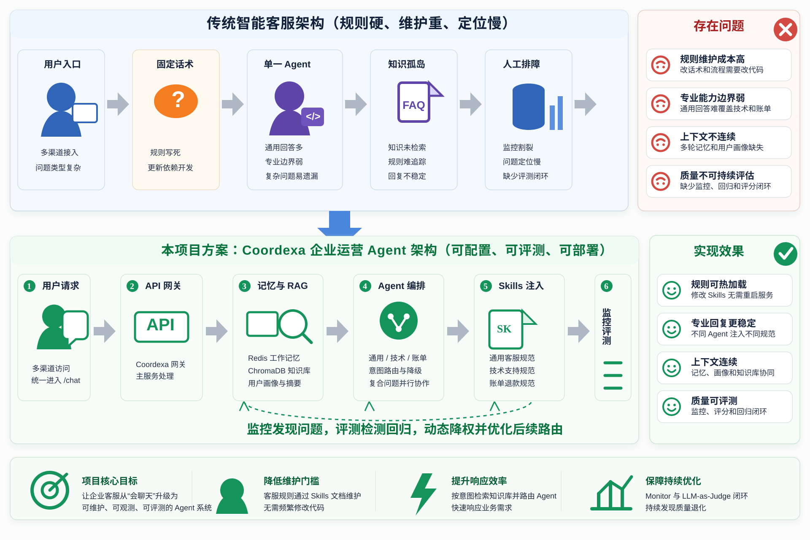
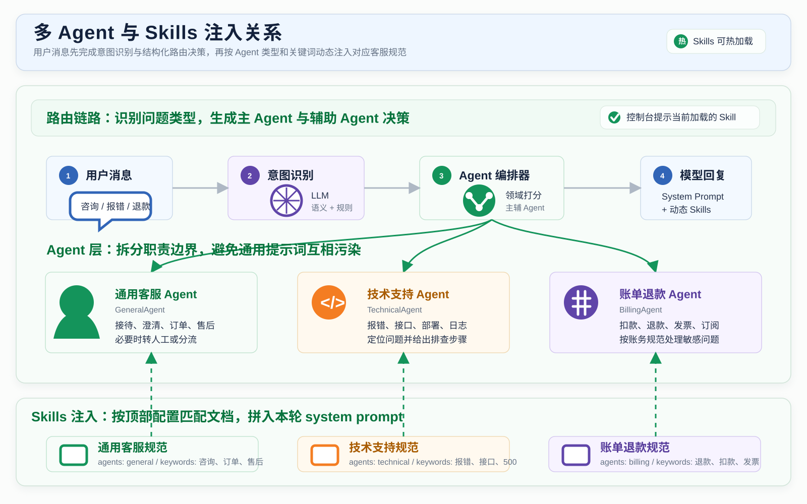
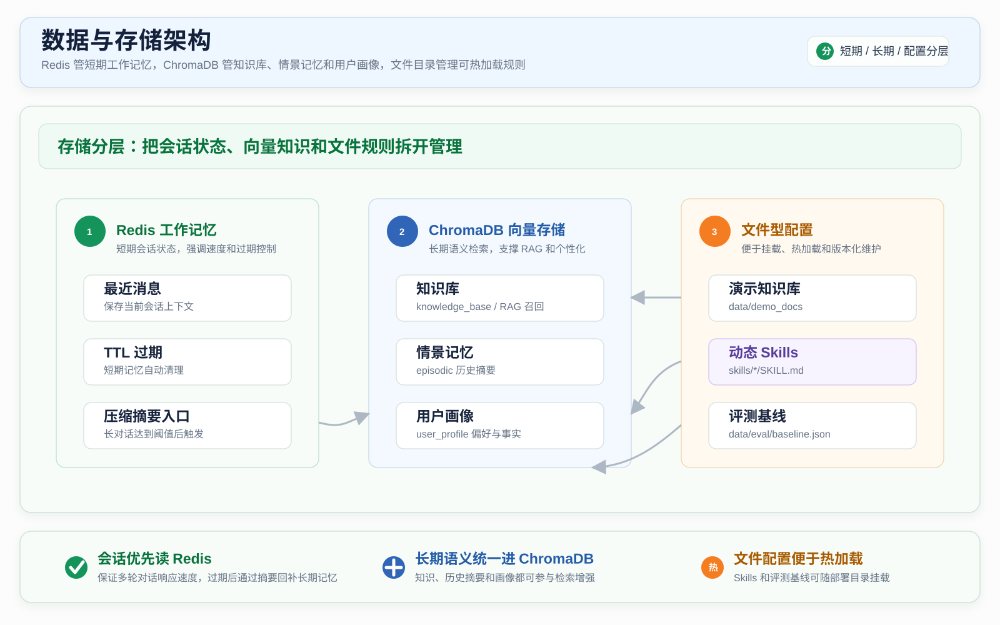
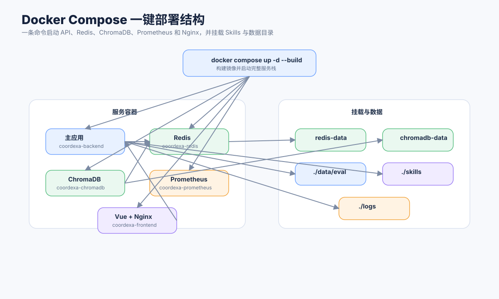

# Coordexa 架构与能力边界

本文档中的图按当前 Coordexa 代码、Docker Compose 服务和已完成的验证流程整理，不代表未接入的生产系统。

## 1. 总体架构



用户通过 Vue 工作台访问系统，Nginx 将 API 请求转发到 FastAPI 后端。后端连接 Redis、ChromaDB 和 Anthropic 兼容模型服务，并向 Prometheus 暴露运行指标。

## 2. `/chat` 主链路


```text
Vue 工作台
  -> POST /chat
  -> Redis / ChromaDB 读取对话上下文
  -> LLM + 本地 n-gram + 规则融合意图识别
  -> RAG 门控决定是否执行知识检索
  -> ChromaDB 多查询召回、中文词面/向量混合排序与可选 LLM 重排
  -> 主 Agent + 辅助 Agent 结构化路由
  -> Skills 与工具白名单注入
  -> Agent 执行与结果合并
  -> 写回工作记忆并异步更新用户画像
  -> Monitor、工具轨迹与评测
```

## 3. 多 Agent 与 Skills



### 角色映射

| 代码节点 | 产品角色 | 当前职责 |
|---|---|---|
| `GeneralAgent` | 运营协调 Agent | 通用咨询、订单物流、信息澄清和跨域协调 |
| `TechnicalAgent` | 技术可靠性 Agent | 登录、错误码、崩溃和配置排查 |
| `BillingAgent` | 收入与合规 Agent | 退款、发票、支付异常和账务核验 |
| `EscalationAgent` | 运营升级通道 | 人工交接摘要和高风险请求升级 |

## 4. 数据与存储



- Redis 保存当前会话的工作记忆及压缩摘要，并设置 TTL。
- ChromaDB 的 `knowledge_base`、`episodic`、`user_profile` 分别保存知识片段、历史摘要和用户画像。
- `skills/*/SKILL.md` 保存可热加载的业务规范。

## 5. 监控与评测闭环


- `/monitor` 汇总 Agent 与工具成功率、耗时、熔断状态和告警。
- `/metrics` 暴露 Prometheus 指标，Prometheus 定时抓取后端和自身状态。
- `/eval/run` 真实调用对话链路，再由 LLM-as-Judge 从相关性、准确性、完整性和有用性四个维度评分。

## 6. Docker Compose 部署



当前 Compose 服务为 `frontend`、`backend`、`redis`、`chromadb` 和 `prometheus`。其中前端容器同时承担 Vue 静态页面服务和 Nginx 反向代理。

## 7. 能力边界

- 当前是可运行的工程原型，不直接连接真实订单、支付、物流或工单系统。
- Escalation 节点生成交接信息，不代表已经创建真实工单。
- 知识库检索结果只来自导入的演示文档。
- Monitor 统计进程内运行数据，不等同于完整生产可观测平台。
- LLM-as-Judge 是辅助评测方法，结果受 Judge 模型和解析成功率影响。
- `mcp/tool_manager.py` 是内部工具管理抽象，不等同于完整 MCP 协议实现。
